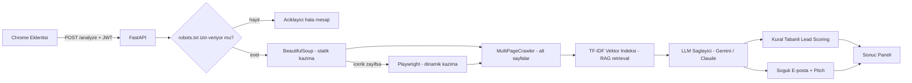
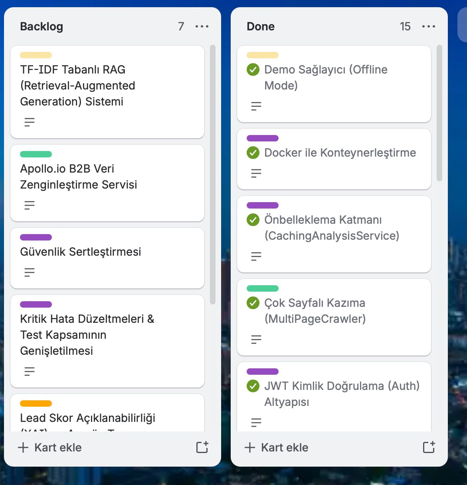
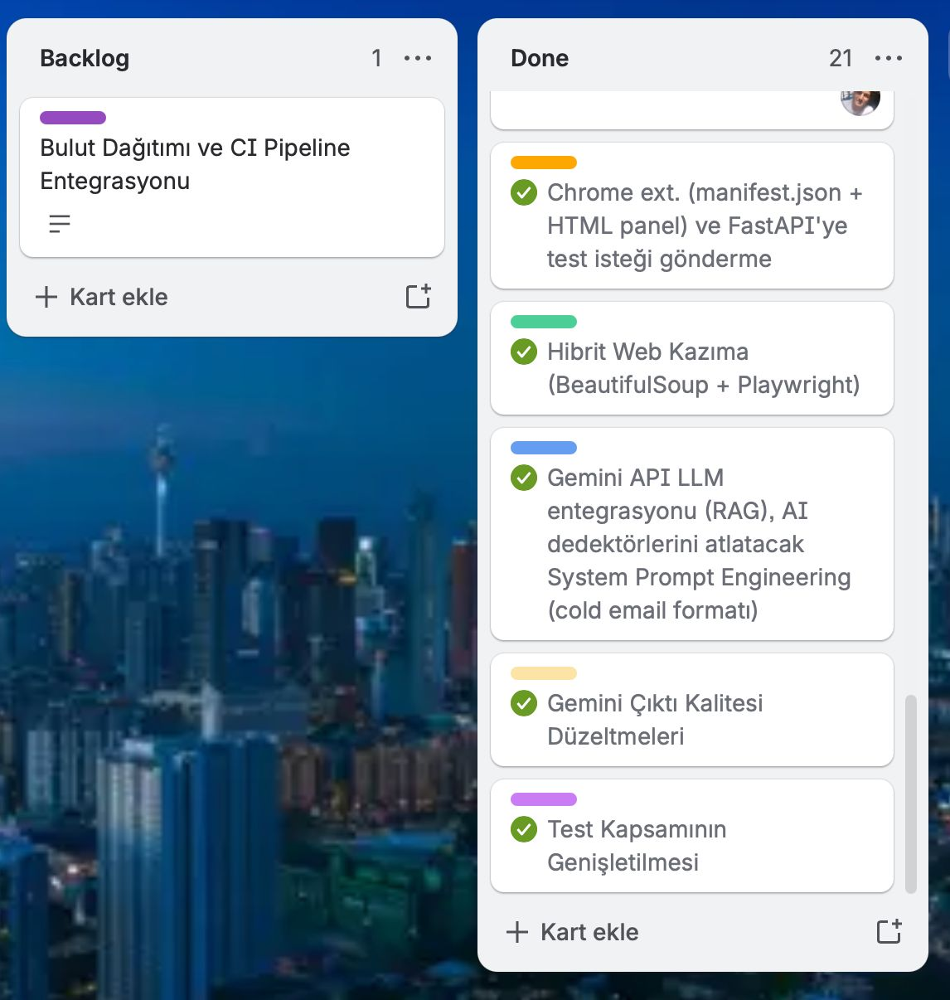

> ### 📌 Bu bir ekip projesidir
>
> **AI Sales Copilot**, Google Yapay Zeka ve Teknoloji Akademisi Bootcamp kapsamında **AI Innovators** ekibiyle
> (4 kişi) geliştirilmiştir. Bu depo, projenin portföyümde sergilediğim kopyasıdır.
>
> **Ana depo:** https://github.com/hkursatakburak/AI-Sales-Copilot
>
> Aşağıdaki dokümanın tamamı ekibin ortak çalışmasıdır. Kendi rolüm ve teknik
> katkılarım hemen aşağıda listelenmiştir.

## Katkılarım — Elifgül Topcu

Rolüm: **Product Owner** + backend / AI geliştirme. Depodaki 21 commit bana aittir.

**Mimari ve iskelet**
- Clean Architecture katmanlarının kurulması (domain / application / infrastructure / api), bağımlılık enjeksiyonu ve uçtan uca çalışan ilk sürüm (Chrome eklentisi ↔ FastAPI)

**Web scraping katmanı**
- BeautifulSoup (statik) + Playwright (dinamik) hibrit kazıyıcı, otomatik fallback mekanizmasıyla
- Güvenlik ve uyum: SSRF koruması (özel IP engelleme), robots.txt denetimi, host bazlı istek sınırlama
- Dayanıklılık: hata taksonomisi (site engeli / zaman aşımı / DNS / SSL), geçici hatalarda backoff'lu yeniden deneme, kullanıcıya sade Türkçe hata mesajları

**LLM entegrasyonu**
- Sağlayıcıdan bağımsız `LLMProvider` soyutlaması ve factory yapısı; Claude ve Gemini sağlayıcılarının ikisi de tarafımdan yazıldı
- Gemini 2.5 Flash'ta içerik zengin sayfalarda çıktının kesilmesi sorununun kök neden analizi ve çözümü (thinking budget yönetimi + toleranslı JSON ayrıştırma)

**Lead scoring ve metin üretimi**
- Kural tabanlı, **açıklanabilir** puanlama motoru — "model neden bu skoru verdi?" sorusu yanıtlanabiliyor
- Few-shot prompting ile klişelerden arındırılmış soğuk e-posta ve toplantı pitch'i üretimi

**Test ve arayüz**
- Backend için birim ve entegrasyon testleri
- Manifest V3 Chrome eklentisi paneli; lead skorunu açıklayan ve güvenilmez sonuçlarda kullanıcıyı uyaran arayüz geliştirmeleri

---


## **Takım İsmi**

**YZTA AI Innovators**

## **Takım Logosu**


## Takım Elemanları

|    | <div align="center">Name</div>   | <div align="center">Title</div>  | <div align="center">Socials</div>     |
| :-----------: | :---------- | :---------- | :----------: |
|    | Elifgül Topcu     | Product Owner     | [](https://www.linkedin.com/in/elifgültopcu/)    | 
|      | Hamza Kürşat Akburak     | Scrum Master     |  [](https://www.linkedin.com/in/hkursat-akburak/) |
|    | Ahmet Bilal Özgün      | Developer      |  [](https://linkedin.com/in/ahmetbilalozgun)   |
|      | Meryem Durdağı      | Developer     |   [](https://www.linkedin.com/in/meryemdurdagi)    |


## Ürün İsmi

**AI Sales Copilot**

## Ürün Logosu


## Ürün Açıklaması

- **AI Sales Copilot**, B2B satış ekiplerinin müşteri araştırması ve kişiselleştirilmiş e-posta hazırlama süreçlerinde kaybettikleri vakti sıfıra indiren, otonom bir Chrome eklentisidir. Kullanıcı bir şirketin web sitesini ziyaret ettiğinde; eklentimiz arka planda çalışan yapay zeka ve veri bilimi algoritmalarıyla siteyi kazır, şirketin acı noktalarını (pain point) tespit eder ve o şirkete özel, klişelerden arındırılmış, doğal bir üslupta "cold email" taslağı sunar. 

## Proje Problemi ve Çözümü

- Satış ekipleri B2B müşteri araştırmasında ve o şirketin vizyonuna uygun, kişiselleştirilmiş e-posta hazırlamada çok vakit kaybetmektedir. Kopyala-yapıştır mailler ise anında reddedilmektedir. **AI Sales Copilot**, bu süreci saniyelere indiriyor. Kullanıcının arka planda girdiği kendi ürün bağlamını aklında tutarak (RAG ile bağlam seçimi), hedef web sitesindeki verileri (Scraping) karşılaştırır. Bu sayede şirkete nokta atışı bir Lead Scoring (Müşteri Uyum Puanı) ve şablon kokmayan, insan üslubunda bir mail sunar.

## Ürün Özellikleri

- Chrome Extension tabanlı hızlı arayüz
- Web Scraping (BeautifulSoup + Playwright) ile anlık veri çekimi
- Gemini/Claude API ve TF-IDF tabanlı RAG (retrieval) ile bağlama duyarlı metin üretimi
- Klişe yasak listesi ve few-shot prompt mühendisliği ile doğal dilde e-posta üretimi
- FastAPI tabanlı asenkron backend mimarisi
- Açıklanabilir Lead Scoring (XAI) — puanın hangi kurallardan geldiği kullanıcıya tek tek gösterilir
- ### Açıklanabilir Puanlama

Lead skoru bir yapay zekâ tahmini değildir; sabit ve denetlenebilir kurallarla
hesaplanır. Bu yüzden kullanıcı yalnızca puanı değil, **puanın neden o olduğunu**
da görür. Arayüzdeki "Bu puan nasıl hesaplanıyor?" paneli, puanlama kurallarının
tamamını ve seviye eşiklerini açıkça listeler:


Skor 0–100 arasındadır: **0–39 Soğuk**, **40–69 Ilık**, **70–100 Sıcak**.
  

## Hedef Kitle

- B2B (İşletmeden İşletmeye) Satış Ekipleri
- SaaS (Hizmet Olarak Yazılım) Satış Temsilcileri
- İş Geliştirme Uzmanları ve Pazarlamacılar

## Pazarlama Planı

- Ürünümüzün "Demo" potansiyeli çok yüksek olduğundan, doğrudan hedef kitlemiz olan LinkedIn'deki satış liderlerine eklentinin yeteneklerini gösteren kısa videolarla ulaşmayı hedefliyoruz.
- Başlangıçta kullanıcılara freemium (kısıtlı ücretsiz) model sunarak organik büyüme sağlanacak, sonrasında API ve token tüketimine bağlı olarak aylık abonelik (SaaS) sistemine geçilecektir.
## Teknoloji ve Mimari

| Katman | Teknoloji |
| :--- | :--- |
| Eklenti | Chrome Manifest V3, HTML/CSS/vanilla JavaScript |
| Backend | Python 3.12, FastAPI, Pydantic v2, Uvicorn |
| Kazıma | BeautifulSoup4 + httpx (statik), Playwright (dinamik) |
| RAG / Retrieval | scikit-learn — TF-IDF vektörleme + kosinüs benzerliği |
| LLM | Google Gemini (`google-genai`), Anthropic Claude (`anthropic`) |
| Veritabanı | SQLAlchemy 2.0 (async) + SQLite (aiosqlite) |
| Kimlik doğrulama | PyJWT (HS256) + bcrypt |
| Test | pytest, pytest-asyncio (169 test) |
| Dağıtım | Docker (multi-stage), docker-compose |

### Analiz Akışı



### Katmanlı Yapı

Proje **Clean Architecture** ile dört katmana ayrılmıştır. Bağımlılıklar daima
içeriye, `domain` katmanına doğru akar:

```
backend/app/
├── domain/           # models.py, interfaces.py — portlar (LLMProvider, WebScraper,
│                     #   ScoringEngine, OutreachWriter, VectorStore, EnrichmentService)
├── application/      # iş kuralları: analiz orkestrasyonu, skorlama, e-posta yazımı,
│                     #   önbellekleme, kimlik doğrulama servisi
├── infrastructure/   # dış dünya adaptörleri
│   ├── scraping/     # beautifulsoup, playwright, hybrid, multi_page_crawler,
│   │                 #   url_guard (SSRF), robots, rate_limiter, html_cleaner
│   ├── llm/          # gemini_provider, claude_provider, demo_provider, factory
│   ├── rag/          # vector_store — TF-IDF indeksleme ve retrieval
│   ├── enrichment/   # apollo_service — B2B şirket veri zenginleştirme
│   └── db/           # SQLAlchemy modelleri ve oturum yönetimi
└── api/              # FastAPI route'ları, şemalar, bağımlılık enjeksiyonu
```

**Bu ayrımın pratik faydası:** Gemini'den Claude'a geçmek için `application` veya
`domain` katmanında tek satır bile değişmez — yalnızca `.env` içindeki
`LLM_PROVIDER` değeri değişir. Aynı şekilde önbellekleme, mevcut analiz servisini
saran bir **Decorator** olarak eklendiği için iş kurallarına hiç dokunulmamıştır.

### API Uç Noktaları

| Metot | Yol | Açıklama | Token |
| :--- | :--- | :--- | :---: |
| `GET` | `/health` | Servis sağlık kontrolü | — |
| `POST` | `/auth/register` | Yeni kullanıcı kaydı | — |
| `POST` | `/auth/login` | Giriş, JWT döner | — |
| `POST` | `/analyze` | Şirket analizi (özet, acı noktaları, skor, e-posta, pitch) | ✔ |
| `POST` | `/email` | Yalnızca e-posta/pitch'i yeniden üretir | ✔ |

---

## Kurulum ve Çalıştırma

### Seçenek 1 — Yerel geliştirme

```bash
git clone https://github.com/hkursatakburak/AI-Sales-Copilot.git
cd AI-Sales-Copilot/backend

python -m venv .venv && source .venv/bin/activate   # Windows: .venv\Scripts\activate
pip install -r requirements-dev.txt
playwright install chromium                          # dinamik kazıma için

cp .env.example .env                                 # ve içini doldurun
uvicorn app.main:app --reload --reload-dir app --port 8000
```

`.env` içinde en az şunlar olmalı:

```env
LLM_PROVIDER=gemini
GEMINI_API_KEY=<https://aistudio.google.com/apikey adresinden ücretsiz alınır>
COPILOT_JWT_SECRET=<python -c "import secrets; print(secrets.token_urlsafe(32))">
```

### Seçenek 2 — Docker

```bash
cp backend/.env.example backend/.env    # önce doldurun
docker compose up --build
```

> Konteyner `production` modunda çalışır ve **varsayılan JWT sırrıyla açılmaz** —
> `COPILOT_JWT_SECRET` ayarlanmazsa nedenini söyleyen bir hatayla durur. Bu kasıtlı
> bir güvenlik önlemidir.

### Eklentinin yüklenmesi

1. Chrome'da `chrome://extensions` adresini açın
2. Sağ üstten **Geliştirici modu**nu etkinleştirin
3. **Paketlenmemiş öğe yükle** → `extension/` klasörünü seçin
4. Backend çalışırken http://localhost:8000/docs → `POST /auth/register` ile bir
   hesap oluşturun
5. Eklentiyi açın, giriş yapın ve bir şirket sitesinde **Analiz Et**'e basın

> **Sağlayıcı modları:** `LLM_PROVIDER=gemini` veya `claude` gerçek analiz yapar.
> `LLM_PROVIDER=demo` ise API anahtarı olmadan **önceden hazırlanmış sabit örnek
> çıktılar** döndürür; yalnızca arayüz denemesi ve çevrimdışı sunum içindir, gerçek
> analiz değildir. Hiç anahtar tanımlanmazsa sistem çökmeden "yalnızca kazıma"
> moduna düşer ve yapay zekâ kartlarını gizler.

## Product Backlog 
markdown
Backlog'umuz Trello üzerinde yönetilmektedir. Etiket renkleri:
🟣 **Backend** · 🟠 **Frontend** · 🟢 **Data Science** · 🟡  **AI / YZ**

| # | Etiket | User Story | Sprint | Puan | Durum |  
| :-: | :---: | :--- | :---: | :-: | :---: |
| 1 | 🟣 | Bir geliştirici olarak, katmanları ayrılmış bir backend iskeleti istiyorum ki yeni özellikler mimariyi bozmadan eklenebilsin. | 1 | 20 | ✅ |
| 2 | 🟠 | Bir satış temsilcisi olarak, bulunduğum sayfayı tek tıkla analiz edebileceğim bir eklenti istiyorum. | 1 | 10 | ✅ |
| 3 | 🟢 | Bir sistem olarak, hem statik hem JavaScript ile yüklenen siteleri okuyabilmeliyim. | 1 | 20 | ✅ |
| 4 | 🟢 | Bir sistem olarak, iç ağ adreslerine istek atmamalı ve robots.txt kurallarına uymalıyım. | 1 | 15 | ✅ |
| 5 | 🟡 | Bir kullanıcı olarak, şirketin özetini ve acı noktalarını görmek istiyorum. | 1 | 10 | ✅ |
| 6 | 🟢 | Bir kullanıcı olarak, lead skorunun **neden** o olduğunu görmek istiyorum. | 1 | 15 | ✅ |
| 7 | 🟡| Bir kullanıcı olarak, şablon kokmayan bir soğuk e-posta ve pitch istiyorum. | 1 | 10 | ✅ |
| 8 | 🟣 | Bir kullanıcı olarak, hesabımla giriş yapıp analizlerimin bana özel olmasını istiyorum. | 2 | 25 | ✅ |
| 9 | 🟢 | Bir sistem olarak, ana sayfa yetersizse alt sayfaları da tarayarak daha iyi analiz üretmeliyim. | 2 | 20 | ✅ |
| 10 | 🟣 | Bir geliştirici olarak, projeyi tek komutla ayağa kaldırabilmek istiyorum. | 2 | 15 | ✅ |
| 11 | 🟣 | Bir sistem olarak, aynı siteyi kısa süre içinde tekrar analiz ederken LLM maliyeti harcamamalıyım. | 2 | 10 | ✅ |
| 12 | 🟡 | Bir sunucu olarak, internet veya API anahtarı olmadan da arayüzü gösterebilmeliyim. | 2 | 10 | ✅ |
| 13 | 🟡 | Bir sistem olarak, içerik zengin sitelerde çıktının kesilmemesini sağlamalıyım. | 2 | 10 | ✅ |
| 14 | 🟡 | Bir sistem olarak, uzun sayfalarda en ilgili bölümleri seçerek modele göndermeliyim (RAG). | 3 | 20 | ✅ |
| 15 | 🟢 | Bir sistem olarak, web sitesinden çıkaramadığım sektör bilgisini harici kaynaktan tamamlayabilmeliyim. | 3 | 10 | ✅ |
| 16 | 🟣 | Bir geliştirici olarak, depoda ölü kod ve veritabanı dosyası olmamasını istiyorum. | 3 | 10 | ✅ |
| 17 | 🟣 | Bir sistem olarak, üretimde zayıf sırlarla ve uydurulmuş verilerle çalışmamalıyım. | 3 | 15 | ✅ |
| 18 | 🟣 | Bir kullanıcı olarak, uygulamanın kurulumdan hemen sonra hatasız çalışmasını istiyorum. | 3 | 15 | ✅ |
| 19 | 🟠 | Bir kullanıcı olarak, lead skorunun ne anlama geldiğini arayüzde anlayabilmek istiyorum. | 3 | 15 | ✅ |
| 20 | 🟣 | Bir geliştirici olarak, kritik bileşenlerin test kapsamında olmasını istiyorum. | 3 | 15 | ✅ |
| 21 | 🟣 | Bir kullanıcı olarak, eklentiyi localhost gerektirmeden kullanabilmek istiyorum (bulut dağıtımı + CI). | 3 | 10 | 🔄 |
| | | | | **300** | |

---

# Sprint 1

- **Sprint Notları**: Görevler Product Backlog'un içine yazılmıştır. Trello üzerindeki item'lara tıklandığında hikayelerin detayları okunabilmektedir.

- **Sprint içinde tamamlanması tahmin edilen puan**: 100 Puan
- **Puan tamamlama mantığı**: Proje boyunca tamamlanması gereken toplam 300 puanlık backlog bulunmaktadır. 3 sprinte bölündüğünde ilk sprintin 100 ile başlaması gerektiği kararlaştırıldı.
- **Backlog düzeni ve Story seçimleri**: Backlog'umuz uygulamanın uçtan uca haberleşmesini sağlayacak temel MVP (Minimum Viable Product) mimarisinin kurulmasına odaklanmıştır. Sprint başına tahmin edilen puan sayısını geçmeyecek şekilde görevler dağıtılmıştır. Trello panomuzda mor etiketler _Backend_, turuncu etiketler _Frontend_, yeşil etiketler _Data Science_, pembe etiketler ise _AI / YZ_ görevlerini temsil etmektedir.

- **Daily Scrum**: Daily Scrum toplantılarının WhatsApp üzerinden yapılması kararlaştırılmıştır. Daily Scrum toplantılarımız Imgur'da toplanmıştır: [Sprint 1 - Daily Scrum Chats](https://imgur.com/a/daily-scrumm-chats-1-YYr65uS)

- **Sprint board update**: Sprint board screenshot: 


- **Ürünün Durumu**:

  Projemizin mevcut ve planlanan geliştirme süreçleri sprint bazlı olarak aşağıda detaylandırılmıştır. İlk sprint başarıyla tamamlanmış olup, sonraki aşamalar tahmini hedefler doğrultusunda planlanmıştır:

  | Sprint | Durum | Ana Hedef | Kapsam | Tahmini Puan |
  | :---: | :---: | :--- | :--- | :---: |
  | **Sprint 1** | Tamamlandı | Çalışan MVP | Repository kurulumu, Temiz Mimari (Clean Architecture) tabanlı backend yapısı, FastAPI ile `/analyze` ve `/email` uç noktaları, BeautifulSoup ve Playwright entegrasyonu ile web kazıma çözümleri, Manifest V3 uyumlu Chrome eklentisi, Gemini entegrasyonu (özet, acı noktası ve sinyal tespiti), kural tabanlı potansiyel müşteri puanlaması (lead scoring) ve temel soğuk e-posta üretimi ile uçtan uca çalışan demo. | 100 |
  | **Sprint 2** | ✅ Tamamlandı | Zenginleştirme ve Sağlamlık | Soğuk e-posta ve pitch kalitesinin artırılması (few-shot öğrenme ve doğal dil tonu), web kazıma kararlılığı (Yeniden deneme mekanizmaları), kullanıcı deneyimi (UX) geliştirmeleri ve birim testleri. | 90 |
  | **Sprint 3** | ✅ Tamamlandı | RAG, Güvenlik ve Ürünleştirme | RAG (TF-IDF retrieval) entegrasyonu, Apollo.io ile B2B veri zenginleştirme, kritik hata düzeltmeleri, güvenlik sertleştirmesi, lead skorunun arayüzde açıklanabilir hale getirilmesi ve test kapsamının genişletilmesi. | 110 |

- **Sprint Review**: 
 - Ürün uçtan uca çalışır durumda teslim edildi ve gerçek bir Gemini API anahtarıyla canlı olarak doğrulandı: sokmarket.com.tr analizinde 642 kelimelik içerikten şirket özeti, 3 acı noktası ve 55/100 (ılık) lead skoru üretildi.
  - Kural tabanlı puanlamanın açıklanabilir olması ekip tarafından doğru bir karar olarak değerlendirildi; "model neden bu skoru verdi?" sorusunu yanıtlayabiliyoruz.
  - Erken alınan sağlayıcı bağımsızlığı kararı sayesinde Claude ve Gemini arasında geçiş maliyetsiz hale geldi.
  - Test altyapısı kuruldu; sprint sonunda 115 test geçiyordu.
  - Sprint Review katılımcıları: Hamza Kürşat Akburak, Elifgül Topcu, Meryem Durdağı, Ahmet Bilal Özgün.

- **Sprint Retrospective:** 
  - **İyi gidenler**: Mimari kararların gerekçeleriyle birlikte alınması, sonraki sprintte hiçbir şeyi baştan yazmamızı gerektirmedi. Testlerin sprint boyunca yazılması, refactor'ları korkusuz hale getirdi.
  - **İyileştirme alanları**: Görev dağılımı sprint başında yeterince netleştirilmediği için katkı dengesiz kaldı. Dokümantasyon işleri sprintin sonuna yığıldı.
  - **Kararlar**: Sprint 2'de her üyeye sprint başında adı yazılı, bağımsız teslim edilebilir görevler atanacak. Ürün iddialarımız kodun gerçekte yaptığıyla düzenli karşılaştırılacak.

---

# Sprint 2

- **Sprint Notları**: Sprint 2'nin temel hedefi, Sprint 1'de kurulan MVP altyapısını güçlendirmek ve ürün kalitesini artırmaktı. Planlanan tüm görevler tamamlanmış; bunların yanı sıra Sprint 3 kapsamındaki bazı özellikler (MultiPageCrawler, Auth altyapısı, Docker) de bu sprint içinde erken teslim edilmiştir.

- **Sprint içinde tamamlanması tahmin edilen puan**: 90 Puan

- **Puan tamamlama mantığı**: Proje boyunca tamamlanması gereken toplam 300 puanlık backlog bulunmaktadır. Sprint 2 için 90 puan hedeflenmiş ve bu hedef eksiksiz gerçekleştirilmiştir. Ekip, erken teslimlerle Sprint 3  görevlerini de kısmen tamamlamıştır.

- **Backlog düzeni ve Story seçimleri**: Sprint 2 backlog'u dört ana eksen etrafında şekillenmiştir: (1) Soğuk e-posta ve pitch kalitesinin artırılması (few-shot prompt ve doğal dil tonu), (2) Çoklu LLM desteği — Claude ve Gemini için sağlayıcıdan bağımsız fabrika yapısı (`factory.py`), (3) Web kazıma kararlılığı — SSRF koruması (`url_guard.py`), robots.txt uyumu (`robots.py`), istek sınırlama (`rate_limiter.py`) ve kullanıcı dostu hata mesajları, (4) Kapsamlı birim test altyapısı.

- **Daily Scrum**: Daily Scrum toplantılarının WhatsApp üzerinden yapılmasına devam edilmiştir. Sprint 2 Daily Scrum toplantılarımız Imgur'da toplanmıştır: [Sprint 2 - Daily Scrum Chats](https://imgur.com/a/daily-scrum-chats-2-ktqlZ4b)

- **Sprint board update**: Sprint board screenshot:


- **Ürünün Durumu**:

  Sprint 2 kapsamında tamamlanan görevler aşağıda listelenmiştir:

  | Görev | Açıklama | Durum | Puan |
  | :--- | :--- | :---: | :---: |
  
  | JWT Kimlik Doğrulama | `/auth/register` ve `/auth/login` uç noktaları; bcrypt ile şifre hashleme; SQLAlchemy + SQLite kullanıcı tablosu. `/analyze` ve `/email` artık token gerektiriyor. Eklentiye giriş ekranı eklendi. | ✅ | 25 |
  | Çok Sayfalı Kazıma (MultiPageCrawler) | Ana sayfa yetersiz kaldığında "Hakkımızda", "Kariyer" gibi en fazla 4 alt sayfayı da tarayan katman. Birim testleriyle teslim edildi. | ✅ | 20 |
  | Docker ile Konteynerleştirme | Çok aşamalı `Dockerfile` ve `docker-compose.yml`; Playwright dahil, root olmayan kullanıcıyla çalışan imaj. | ✅ | 15 |
  | Önbellekleme Katmanı | `CachingAnalysisService` — Decorator deseniyle TTL önbellek. Tekrarlanan analizlerde LLM maliyeti harcanmaz. | ✅ | 10 |
  | Demo Sağlayıcı | `LLM_PROVIDER=demo` — anahtar olmadan arayüzün gösterilebilmesi. Sunum içindir; gerçek analiz değildir. | ✅ | 10 |
  | Gemini Çıktı Kalitesi Düzeltmeleri | SDK uyumluluğu ve içerik zengin sitelerde çıktının kesilmemesi için token bütçesinin yükseltilmesi. | ✅ | 10 |
- **Sprint Review**:
  - Sprint 2 kapsamındaki tüm planlanan görevler (90 puan) başarıyla tamamlandı.
  - Çoklu LLM desteği hayata geçirildi; sistem artık hem Gemini hem de Claude API'yi desteklemekte, sağlayıcı değişikliği yalnızca `.env` konfigürasyonuyla yapılabilmektedir.
  - SSRF koruması, robots.txt uyumu ve rate limiter ile web kazıma katmanı production-ready hale getirildi.
  - Test altyapısı genişletildi; sprint sonunda 122 test geçiyordu.
  - Sprint 3  hedeflerinden bazıları erken teslim edildi (MultiPageCrawler, Auth, Docker) — bu durum ilerleyen sprintlerin yükünü önemli ölçüde hafifletti.
  - Sprint Review katılımcıları: Hamza Kürşat Akburak, Elifgül Topcu, Meryem Durdağı, Ahmet Bilal Özgün.

- **Sprint Retrospective**:
  - **İyi gidenler**: Ekip hızı beklentilerin üzerinde gerçekleşti. Clean Architecture sayesinde yeni LLM sağlayıcısı eklemek minimum kod değişikliğiyle mümkün oldu. Birim testleri, scraping ve LLM katmanında güven sağladı.
  - **İyileştirme alanları**: Sprint board ekran görüntüsü daha düzenli güncellenmelidir. Daily Scrum loglarının sistematik biçimde arşivlenmesi hedeflenmektedir.
  - **Kararlar**: Sprint 3'te RAG + vektör veritabanı entegrasyonu ve Apollo.io veri zenginleştirmesi önceliklendirilecektir. Erken teslim edilen MultiPageCrawler, Sprint 3'te bu pipeline'a doğrudan entegre edilecek.

---


# Sprint 3

- **Sprint Notları**: Sprint 3, ürünü "çalışan bir uygulamadan" "güvenilir bir
  ürüne" taşıma sprintidir. Sprint iki yarıya ayrıldı: ilk yarıda planlanan yeni
  yetenekler (RAG ve B2B veri zenginleştirme) geliştirildi; ikinci yarıda ise
  ekip olarak yaptığımız **kapsamlı bir kod ve dokümantasyon denetimi** sonucunda
  bulunan hatalar giderildi ve ürünün iddiaları koda birebir eşitlendi.

- **Sprint içinde tamamlanması tahmin edilen puan**: 110 Puan

- **Puan tamamlama mantığı**: 300 puanlık backlog'un 190 puanı ilk iki sprintte
  tamamlanmıştır. Kalan 110 puan Sprint 3'e atanarak backlog kapatılmıştır.

- **Backlog düzeni ve Story seçimleri**: Sprint 2 retrospektifinde alınan kararlar
  doğrultusunda görevler seçilmiştir. Sprint 2'de teslim edilen MultiPageCrawler,
  bu sprintte RAG pipeline'ının doğrudan veri kaynağı olarak kullanılmıştır. Sprint
  ortasında yapılan denetim, planlanmamış ancak kritik bir görev kalemi (hata
  düzeltmeleri ve güvenlik sertleştirmesi) doğurmuş ve backlog'a eklenmiştir.

- **Daily Scrum**: Daily Scrum toplantılarına WhatsApp üzerinden devam edilmiştir.
  Sprint 3 toplantı kayıtlarımız: [Sprint 3 - Daily Scrum Chats](https://imgur.com/a/daily-scrum-chats-3-Gl2G33U)

- **Sprint board update**:
  

- **Ürünün Durumu**:

  | Görev | Açıklama | Durum | Puan |
  | :--- | :--- | :---: | :---: |
  | RAG (Retrieval-Augmented Generation) | `VectorStore` portu ve `SimpleVectorStore` adaptörü. Taranan metin parçalara ayrılır, `scikit-learn` ile TF-IDF vektörlerine dönüştürülür ve kosinüs benzerliğine göre en ilgili parçalar seçilerek modelin prompt'una eklenir. Her analiz isteği için sıfırdan, izole bir indeks oluşturulur. | ✅ | 20 |
  | Apollo.io Veri Zenginleştirme | `EnrichmentService` portu ve Apollo.io adaptörü. Web sitesinden çıkarılamayan sektör ve teknoloji bilgileri harici kaynaktan tamamlanır. API anahtarı log ve proxy sızıntılarına karşı URL parametresi yerine HTTP başlığında iletilir; anahtar yoksa servis sessizce devre dışı kalır. | ✅ | 10 |
  | Kritik Hata Düzeltmeleri | Kurulum sonrası uygulamanın açılmasını engelleyen veritabanı klasörü hatası; e-posta ve toplantı sunumunun cümle ortasında kesilmesi; sektörü büyük harfle yazılan şirketlerin puan kaybetmesi. Ayrıntılar "Karşılaştığımız Zorluklar" bölümünde. | ✅ | 15 |
  | Güvenlik Sertleştirmesi | Üretim ortamında varsayılan JWT sırrıyla açılışın engellenmesi; zenginleştirme servisinin veri uydurmasının önlenmesi; API anahtarlarının yapılandırmaya taşınması. | ✅ | 15 |
  | Arayüz ve Açıklanabilirlik | Lead skorunun yeniden tasarımı (renk kodlu seviye rozeti, ilerleme çubuğu, eşik cetveli), puanlama kurallarının arayüzde gösterilmesi, zayıf içerik uyarısı, adım adım analiz göstergesi ve genel görsel düzenleme. | ✅ | 15 |
  | Test Kapsamının Genişletilmesi | Kimlik doğrulama, önbellek, demo sağlayıcı, RAG, zenginleştirme ve skorlama katmanları test kapsamına alındı. Test sayısı 122'den **164**'e çıktı. | ✅ | 15 |
  | Depo Hijyeni ve Konteyner Düzeltmeleri | Sürüm kontrolüne girmiş SQLite veritabanı dosyası kaldırıldı ve `.gitignore` genişletildi; kök dizindeki kullanılmayan Sprint 0 kalıntıları silindi; `docker compose` artık `.env` dosyası olmadan da ayağa kalkıyor ve sağlık kontrolü harici araç gerektirmiyor. | ✅ | 10 |
  | Bulut Dağıtımı ve CI | GitHub Actions ile her push'ta otomatik test/lint; backend'in bulut ortamına dağıtımı; eklentinin canlı adrese bağlanması | 🔄 | 10 |

- **Sprint Review**:
  - RAG katmanı analiz hattına bağlandı ve uzun sayfalarda modele gönderilen içerik
    artık gelişigüzel kırpma yerine ilgiye göre seçiliyor.
  - Sprint ortasında yapılan kod denetimi sprintin en değerli çıktısı oldu: yalnızca
    testlerin yakalayamadığı, gerçek kullanımda ortaya çıkan yedi ayrı hata bulundu
    ve giderildi. Bunların üçü (veritabanı klasörü, metin kesilmesi, Türkçe sektör
    eşleştirmesi) doğrudan son kullanıcıyı etkiliyordu.
  - Lead skorunun arayüzde açıklanır hale gelmesi, projenin "açıklanabilir yapay
    zekâ" iddiasını ilk kez gözle görülür kıldı.
  - Test sayısı 122'den 164'e çıktı; Sprint 2 retrospektifinde işaret edilen test
    boşlukları kapatıldı.
  - Sprint Review katılımcıları: Hamza Kürşat Akburak, Elifgül Topcu, Meryem Durdağı,
    Ahmet Bilal Özgün.

- **Sprint Retrospective**:
  - **İyi gidenler**: Ürünü gerçek sitelerde tek tek denemek, testlerin göremediği
    hataları ortaya çıkardı — özellikle Türkçe karakterlerden kaynaklanan puan kaybı
    yalnızca canlı denemede fark edilebilirdi. Kod denetimini sprintin ortasında
    yapmak, hataların dokümantasyona yanlış bilgi olarak geçmesini önledi.
  - **İyileştirme alanları**: Harici bir SDK'nın (`google-genai`) sürümü sabitlenmediği
    için kütüphane sessizce değişti ve kod kırıldı; bağımlılıkların tamamı gözden
    geçirilmelidir. Ayrıca bazı raporlarımızda "test kapsamı %100" gibi ölçülenden
    daha iddialı ifadeler kullandığımızı fark ettik — teknik iletişimde ölçtüğümüz
    değeri aynen aktarmayı kararlaştırdık.
  - **Kararlar**: (1) Sürekli entegrasyon (CI) kurularak "testi geçmeyen kod merge
    edilmez" kuralı otomatikleştirilecek, (2) bağımlılık sürümleri sabitlenecek,
    (3) ürünün az içerikli veya hata veren sayfalarda daha temkinli davranması
    üzerinde çalışılacak.
    
## Karşılaştığımız Zorluklar ve Çözümleri

Bu bölüm, geliştirme sırasında karşılaştığımız gerçek problemleri ve kök neden
analizlerini belgelemektedir.

**1. Bozuk karakterler — Brotli sıkıştırma**
Bazı sitelerden çekilen metin okunamayan karakterler içeriyordu. Sebep, gerçekçi
tarayıcı başlıkları gönderdiğimiz için sunucunun yanıtı `br` (Brotli) ile
sıkıştırması, istemcimizin ise bunu açamamasıydı. Çözüm: `brotli` bağımlılığı
eklendi ve metinden kontrol karakterleri temizlendi.

**2. Metinlerin cümle ortasında kesilmesi — düşünen model sorunu**
Soğuk e-posta ve toplantı sunumu bazen cümle ortasında bitiyordu. Kök neden:
Gemini 2.5 Flash bir "düşünen" modeldir ve düşünme (thinking) token'ları çıktı
bütçesinden harcanır. Üstelik harcanan miktar çağrıdan çağrıya değişir.

İlk çözümümüz düşünmeyi tamamen kapatmaktı; ancak `google-genai` SDK'sı sürüm
yükseltmesiyle bu seçeneği kaldırdı — kütüphanenin sürümünü sabitlemediğimiz için
kod sessizce kırıldı. Token limitini yükseltmek de yetmedi: 4096 token ile bile
kesilme yaşandı. Kalıcı çözüm, kesilmeyi modelin `finish_reason` değeri üzerinden
**tespit edip bütçeyi büyüterek bir kez yeniden denemek** oldu. Böylece maliyet
yalnızca gerçekten gerektiğinde artıyor. SDK sürümü de artık sabitlenmiştir.

**3. Gelişmiş bot korumaları**
Bazı büyük sitelerin gerçekçi tarayıcı başlıklarıyla bile 403 döndürdüğünü gördük.
Bu korumaları aşmayı **kapsam dışı ve etik dışı** kabul ettik. Bunun yerine
kullanıcıya "bu site otomatik erişime kapalı" şeklinde anlaşılır bir mesaj gösteren
bir hata taksonomisi geliştirdik.

**4. RAG indeksinde şirketler arası veri sızıntısı**
RAG vektör deposu ilk sürümde uygulama ömrü boyunca yaşayan tekil (singleton) bir
nesneydi. Bu, A şirketi için indekslenen metin parçalarının B şirketinin analizinde
de aranabilir olması anlamına geliyordu — bir analiz, başka bir şirketin verisiyle
kirlenebilirdi. Sorun kod incelemesinde yakalandı; tekil önbellek kaldırılarak her
analiz çağrısında sıfırdan, izole bir indeks oluşturulacak şekilde düzeltildi ve
izolasyonu doğrulayan bir test eklendi.

**5. Türkçe büyük harf, lead skorunu sessizce düşürüyordu**
Sektörü büyük harfle yazılan şirketler hedef sektör puanını (25) alamıyordu.
Kök neden, Python'un `str.lower()` metodunun Türkçe'ye göre çalışmamasıdır:
`"YAZILIM".lower()` → `"yazilim"` (noktasız "ı" yerine noktalı "i") ve
`"E-TİCARET".lower()` → `"e-ti̇caret"` (birleşik nokta karakteri kalır). Her iki
sonuç da hedef listesiyle eşleşmiyordu. Yani aynı şirket, modelin sektörü büyük mü
küçük mü harfle yazdığına göre farklı puan alıyordu. Çözüm: karşılaştırmadan önce
her iki tarafı da Türkçe karakterlerden arındıran bir normalleştirme katmanı ve
bunu koruyan 17 test.

**6. Veritabanı dosyasını depodan çıkarmanın yan etkisi**
SQLite veritabanı yanlışlıkla sürüm kontrolüne eklenmişti; kaldırdık. Ancak bu,
beklenmedik bir sonuç doğurdu: veritabanı dosyası artık depoda olmadığı için onu
barındıran klasör de klonlanmıyordu ve SQLite **dosyayı oluşturabilse de klasörü
oluşturamaz**. Sonuç: projeyi sıfırdan klonlayan herkes açılışta
"unable to open database file" hatası alıyordu. Çözüm, veritabanı motoru kurulmadan
önce klasörün varlığını garantilemek oldu.

**7. Kimlik doğrulamanın mevcut testleri kırması**
`/analyze` ve `/email` uç noktalarına JWT zorunluluğu eklendiğinde tüm entegrasyon
testleri 401 dönmeye başladı. Çözüm: FastAPI'nin `dependency_overrides` mekanizmasıyla
testlerde `get_current_user` bağımlılığı sahte bir kullanıcıyla değiştirildi —
böylece testler kimlik doğrulamadan bağımsız kaldı.

### Ürünün Son Hali

Aşağıdaki kayıt, Sprint 3 tamamlandıktan sonraki güncel arayüzü göstermektedir.
Bu sprintte giderilen sorunların ürüne yansıması burada görülebilir:

- **Lead skoru artık açıklanabilir**: çıplak bir sayı yerine seviye rozeti,
  ilerleme çubuğu, eşik cetveli ve "bu puan nasıl hesaplanıyor?" paneli
- **Yarıda kesilen metinler giderildi**: soğuk e-posta ve toplantı sunumu
  eksiksiz üretiliyor (bkz. "Karşılaştığımız Zorluklar", madde 2)
- **Zayıf içerik uyarısı**: analiz için yetersiz veri çekildiğinde kullanıcı
  bilgilendiriliyor
- **Demo modu bandı**: sahte çıktının gerçek analiz sanılması engellendi

Kayıt gerçek Gemini API çağrılarıyla, `solgar.com.tr` üzerinde alınmıştır.


https://github.com/user-attachments/assets/ae94ad4b-f85d-4082-b43a-91f363bf55b5


### Ürünün Durumu ve Tanıtım Görselleri

Uygulamanın çalışma akışını ve arayüzünü gösteren hareketli ekran görüntüleri (GIF) aşağıda yer almaktadır:


